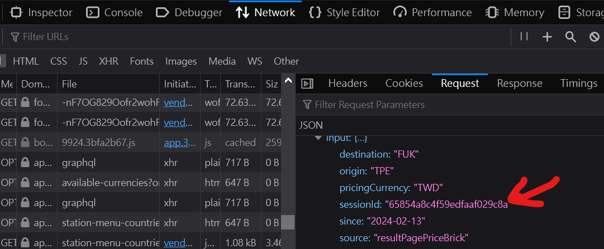

# Customized Skyscanner

a customized skyscanner for north-east asia flight tickets

## Description

use Python for crawling data, then use Tableau for data visualization

## Getting Started

### Dependencies

- python 3.8.8
- pandas 1.3.3
- requests 2.26.0

### Executing program

**【Update sessionId】**

- go to Tiger Airline and search a flight, for [example](https://booking.tigerairtw.com/?type=single&outbound=TPE-FUK&departureDate=2024-02-14&adult=1&children=0&infant=0&languageCode=zh-tw&promoCode=&currencyCode=TWD)
- inpect the webpage and reload
- find the sessionId
  
- update the sessionId in the **_./config/payload.json_**

**【Update airline ticket data】**

```
cd Customized_Skyscanner
python main.py
```

**【Tableau presentation】**
- use Tableau Public to access this dashboard
  https://public.tableau.com/app/profile/xin.huang3860/viz/TigerAirlineTicketbyxinhuangtien/Tiger#1


## TODO

1. more detailed information
2. more airline (Peach, Jetstar and Scoot)

## Help

Any advise for common problems or issues.

```
Email: tom.h.huang@fubon.com
Tel: 02-2771-6699 #61381
Dept: 證券 數據科學部 資料服務處(6F)
```

## Authors

Contributors names and contact info

- [tom.h.huang](tom.h.huang@fubon.com)
- [hsiang.hung](hsiang.hung@fubon.com)

## Version History

- 0.1
  - Initial Release

## Source

some references and third-party tools

- [Peach Airline](https://www.flypeach.com/tw)
- [Tiger Airline](https://www.tigerairtw.com/zh-tw)
